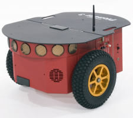

# Robô Pioneer 3-DX



O robô disponível no laboratório é um **Pioneer 3-DX**, um robô móvel de tração diferencial, como o mostrado na imagem acima.

---

## Arquitetura do Robô

O robô possui uma arquitetura de computação dupla:

* **Microcontrolador (Aria):** É o cérebro de "baixo nível". Ele roda um sistema operacional embarcado chamado **Aria** e é responsável pelo controle direto dos motores (rodas), obtenção da pose e leitura de sonares.
* **Computador Interno:** É o cérebro de "alto nível". É um computador rodando **Ubuntu Server 12.04**, que por sua vez possui o **ROS1 (Hydro Medusa)** instalado.

> **Por que ROS1 e não ROS2?**
> A comunicação entre o ROS e o sistema Aria é feita por um pacote chamado `RosAria`. Este pacote foi desenvolvido apenas para ROS1. Como esses robôs são considerados legados, não houve um esforço da comunidade para portar o driver para o ROS2.

---

## Passo 1: Acessando o Computador do Robô

Para enviar comandos para o robô, você primeiro precisa se conectar ao computador interno dele. Existem duas formas principais de fazer isso.

### Método 1: Via SSH (Recomendado)

SSH é um protocolo de rede que permite controlar um computador remotamente de forma segura.

1.  Garanta que seu computador e o robô estejam conectados à **mesma rede Wi-Fi**.
2.  Abra um terminal no seu computador e digite o seguinte comando (substitua pelo IP correto do robô, se necessário):

```bash
ssh root@192.168.1.100
```

3.  Será solicitada uma senha. A senha padrão do robô é: `Expertinos`

Após isso, você estará dentro do terminal do computador do robô e pronto para o próximo passo.

### Método 2: Acesso Físico (Via Terminal)

Você também pode conectar um monitor e um teclado diretamente nas portas do computador interno do robô. Esta é uma forma de acesso direto, útil se a rede Wi-Fi estiver com problemas.

---

## Passo 2: Iniciando o Driver RosAria

Uma vez que você esteja **dentro do terminal do robô** (seja via SSH ou Acesso Físico), você pode iniciar o nó do ROS que faz a ponte com o microcontrolador.

Execute o seguinte comando no terminal *do robô*:

```bash
rosrun rosaria RosAria _port:=/dev/ttyS0 _baud:=9600
```

* **O que esse comando faz?** Ele inicia o driver `RosAria`, que começa a escutar os comandos do ROS e a traduzi-los para o microcontrolador (Aria) através da porta serial interna do robô, a `/dev/ttyS0`.

---

## Alternativa: Controle por Computador Externo (Via USB)

Existe uma terceira forma de controlar o robô que **ignora o computador interno dele**.

Neste método, você conecta o seu próprio computador/notebook (que deve ter o ROS1 instalado) diretamente na porta serial do robô, usando um conversor **Serial-USB**.

1.  Conecte o cabo Serial-USB do robô à porta USB do seu computador.
2.  (Opcional) Você pode precisar dar permissão à porta USB: `sudo chmod a+rw /dev/ttyUSB0`
3.  Execute o seguinte comando no terminal do **seu computador**:

```bash
rosrun rosaria RosAria _port:=/dev/ttyUSB0 _baud:=9600
```

> **Nota:** Repare que a porta mudou. Em vez de `/dev/ttyS0` (a porta serial interna do robô), estamos usando `/dev/ttyUSB0`, que representa a porta USB do *seu* computador onde o robô está conectado.